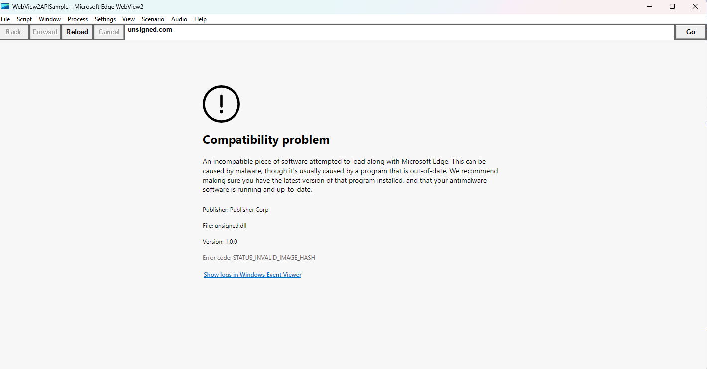

# Code Integrity in WebView2

## Why it is important
Code integrity is a feature of Windows that verifies the authenticity and integrity of the code that runs on your system. It helps protect your system from malware, tampering, and unauthorized changes. Code integrity checks the digital signatures of the files that are loaded into memory, and prevents any file that does not have a valid signature from running in webview2.

## Symptoms
Child process failed with kind COREWEBVIEW2_PROCESS_FAILED_KIND_RENDER_PROCESS_EXITED
and exit code -1073740760 or STATUS_INVALID_IMAGE_HASH.

Users may see error page in the WebView2:

## Update antimalware software
Starting versions 118 and 119 the options to disable Code Integrity in WebView2 are deprecated and the guard is always on.
We are seeing cases where old antimalware software violating our policies. Please make sure that antimalware on your devices is up to date when using WebView2.

## Identify the dll

**Programmatically** app can subscribe to [ProcessFailed event](https://learn.microsoft.com/en-us/microsoft-edge/webview2/concepts/process-related-events?tabs=dotnetcsharp#events-for-processes-that-exited-or-failed). [Starting from 120.0.2164.0](https://learn.microsoft.com/en-us/microsoft-edge/webview2/release-notes?tabs=dotnetcsharp#experimental-apis)
`FailureSourceModulePath` property in the `ProcessFailedEventArgs` contains full path of the module that caused the crash in cases of Windows code integrity failures.

**Compatibility problem** web page may also show the culprit file otherwise use Event Viewer.

Open Event Viewer by typing eventvwr in the search box on the taskbar and selecting the app.

 - In the left pane, expand Windows Logs and click on System.
 - In the right pane, click on Filter Current Log.
 - In the Filter tab, under Event sources, select Microsoft-Windows-CodeIntegrity and click on OK.
 - You will see a list of events related to code integrity – search for the ones with msedgewebview2.exe process.
 - The file name and path of the file that caused the code integrity violation are shown in the message.

