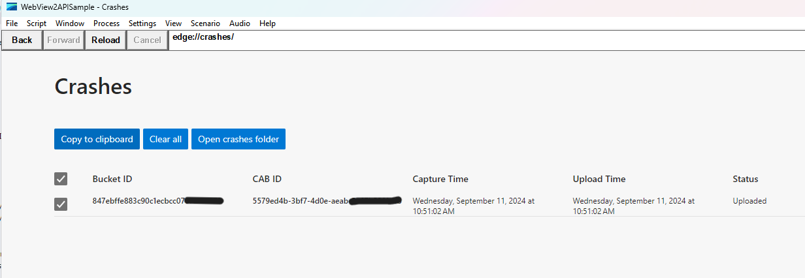

# Crash Dumps
Crash dumps are used to better understand why a WV2 process is crashing and firing a [ProcessFailed](https://learn.microsoft.com/dotnet/api/microsoft.web.webview2.core.corewebview2.processfailed) event. If you're experiencing crashes, the information included in the [ProcessFailed event arguments](https://learn.microsoft.com/dotnet/api/microsoft.web.webview2.core.corewebview2processfailedeventargs) is a good starting point:
- ExitCode
- ProcessDescription
- ProcessFailedKind
- Reason

In addition to that, crash dumps are extremely helpful. WV2 crash dumps are located in a subfolder of the app's user data folder (UDF): `<UDF>\EBWebView\Crashpad\reports\`.
By default the user data folder is created in the app's folder by default with a name like
`<App Exe Name>.exe.WebView2`. If an app sets its user data folder location manually when creating a [WV2 Environment object](https://learn.microsoft.com/dotnet/api/microsoft.web.webview2.core.corewebview2environment), it may be in a different location.

If you do not have crash dumps - please navigate your webview2 control to `edge://crashes` to see if there are new reports. Copy necessary data to Clipboard and share with us.

Sometimes `edge://crashes` might not show crashes, then open Event Viewer by searching for eventvwr in the Windows search box.

- In the left pane, expand Windows Logs and click on System.
- In the right pane, click on Filter Current Log.
- In the Filter tab, under Event sources, select **Windows Error Reporting** and click on OK.
- You will see a list of events related to Windows Error Reporting – search for the ones with msedgewebview2.exe process. Also `Date and Time` column might help you better locate your crash.
- Copy all the details shown in the `General` tab while reporting a crash