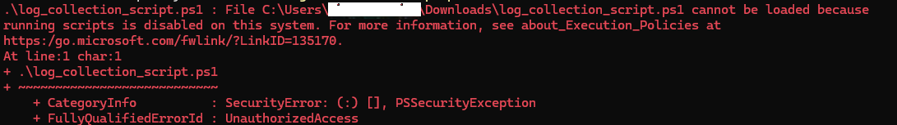

## Automatic Log collection using script

The script automates collection of commonly requested WebView2 diagnostic data — ETW traces and installer logs — to minimize the effort required when reporting issues. It produces a single compressed archive that can be shared with the WebView2 support team for analysis.

### Procedure

1. Download the [script file](resources/log_collection_script.ps1).
2. Open an elevated PowerShell window (**Run as Administrator**).
3. Run the script by executing:

```
.\log_collection_script.ps1
```

The script will collect some registry keys and directory listings, start a WPR trace, and display a window similar to the image below.


4. Reproduce the issue you are experiencing.
5. In the window, click the `Stop WPR Trace` button to end tracing. The script will then complete the data collection and create a compressed archive in the directory where the script was run.
6. The resulting zip would contain following
   - EdgeUpdate_Registry.txt
   - EdgeWebView_Directory.txt
   - WebView2_Trace.etl
   - MicrosoftEdgeUpdate.log (*optional*)
   - MicrosoftEdgeUpdate_LocalAppData.log (*optional*)
   - msedge_installer_Temp.log (*optional*)
   - msedge_installer_SystemTemp.log (*optional*)
   - msedge_installer_SystemTemp2.log (*optional*)
7. Provide the resulting ZIP file to the WebView2 support team for analysis.

**Optional**

To specify a different output directory for the ZIP file, provide the `ZipPath` parameter when running the script:

```
.\log_collection_script.ps1 -ZipPath <folder-path>

```

**Troubleshooting**

If you encounter an execution policy error when running the script:


This error indicates that the current execution policy on your system is preventing the script from running.

1. Check your current execution policy:
```shell
Get-ExecutionPolicy
```
Note the current value to restore it after completing the diagnostic collection.

2. Temporarily set the execution policy to Bypass:
```shell
Set-ExecutionPolicy -ExecutionPolicy Bypass
```

3. Run the log collection script and complete the diagnostic process.

4. Restore the original execution policy:
```shell
Set-ExecutionPolicy -ExecutionPolicy <previous-value>
```