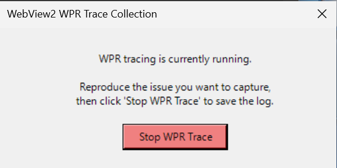

## Automatic Log collection using script

The script automates collection of commonly requested WebView2 diagnostic data — including ETW traces and installer logs — to minimize the effort required when reporting issues. It produces a single compressed archive that can be shared with the WebView2 support team for analysis.

### Procedure

1. Download the script file from [log_collection_script.ps1](resource/log_collection_script.ps1).
2. Open an elevated PowerShell window (**Run as Administrator**).
3. Run the script by executing:

```
.\log_collection_script.ps1
```

   The script will collect some registry keys and directory listings, start a WPR trace, and display a window similar to the image below.



4. Reproduce the issue you are experiencing.
5. In the window, click the `Stop WPR Trace` button to end tracing. The script will finalize the collection and create a compressed archive in your TEMP directory.
6. Provide the resulting ZIP file to the WebView2 support team for analysis.

**Optional**

To specify a different output directory for the ZIP file, provide the `ZipPath` parameter when running the script:

```
.\log_collection_script.ps1 -ZipPath <folder-path>
```