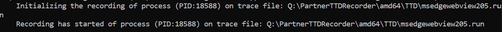
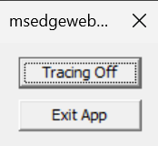
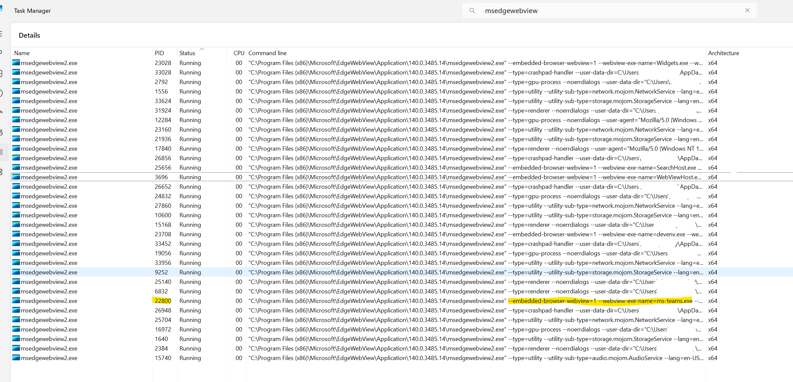

## Time Travel Debugging (TTD)
Time Travel Debugging (TTD) is a powerful debugging tool that records comprehensive execution data including instructions, memory states, register values, and API calls. This technology enables you to rewind and replay application execution deterministically, making it invaluable for diagnosing complex issues.

### Prerequisites

1. Download and install TTD using the [Preferred Method](https://learn.microsoft.com/en-us/windows-hardware/drivers/debuggercmds/time-travel-debugging-ttd-exe-command-line-util).
2. After installation, the TTD command (`ttd.exe`) will be available in your system PATH.
3. **Important**: TTD requires administrative privileges - always run commands from an elevated command prompt.
### Collecting TTD Traces

#### Browser Process Tracing

1. **Find the browser process ID** following the [steps outlined below](#finding-process-id)

2. **Start TTD tracing** with the following command:
   ```
   ttd.exe -attach <browser-pid>
   ```
   > **Tip**: Use the `-out` parameter to specify a custom output location for the trace files.

3. **Wait for confirmation** - You should see a message indicating that tracing has started:
   

4. **Monitor the trace** - A small control window will also appear:
   
   

5. **Reproduce the issue** - Execute the scenario you want to debug. Note that TTD may cause slight performance degradation during recording.

6. **Stop tracing** - Click the **Tracing Off** button in the control window when you've finished reproducing the issue.
 
#### Renderer Process Tracing
 
For renderer process or any sandboxed process, it’s important to use the `--no-sandbox` argument as sandboxing restricts debugger-level access and prevents trace recording. These are the options to set this to the setting:

- **Option 1: "Windows Environment Variable Update"**: 

    * Search **Edit the System environment variable** in windows search and open the window.

    * Click on the Environment variables button and add a new entry with key: `WEBVIEW2_ADDITIONAL_BROWSER_ARGUMENTS` and value: `--no-sandbox`.

- **Option 2: "WebView2 Utility"**: 

    * Open [WebView2 utilities](https://david-risney.github.io/WebView2Utilities/) and go to your app.

    * Select **Open Overrides** and add `--no-sandbox` in the Browser Arguments section.


1. **Restart your application** - Close all instances and restart to apply the `--no-sandbox` argument
2. **Find the renderer process ID** following the [steps outlined below](#finding-process-id)
3. **Start TTD tracing**:
   ```
   ttd.exe -attach <renderer-pid>
   ```
4. **Monitor and reproduce** - The TTD control window will appear. Reproduce your scenario and click "Tracing Off" when complete.
5. **Security cleanup** - Remove the `--no-sandbox` argument after collecting the trace to restore normal security.
 
In both the cases, *.out* and *.run* files will be saved to the specified location (or in the same folder from where you are running your commands if you haven't specified anything). 

For more details on the ttd and to capture other processes, refer to [Microsoft Learn](https://learn.microsoft.com/en-us/windows-hardware/drivers/debuggercmds/time-travel-debugging-ttd-exe-command-line-util)


### Steps to find PID for a process

- Open the Task Manager and go to Details pane.

- If the Details view does not show **Command Line** column, right click on any column and select **Select Columns**. Now add **Command Line** column to the view.

- Search for the msedgewebview2.exe process and find the process which contains the “--embedded-browser-webview=1 --webview-exe-name={`app-exe-name`}” argument. Get the PID of the process.


**Image showing Browser Process for ms-teams.exe's webview2.**

   
