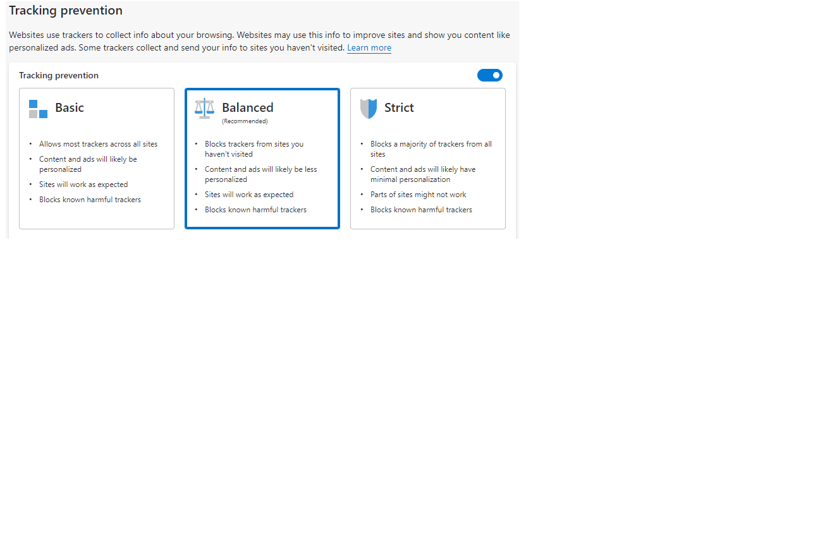

Tracking Prevention
===

# Background
The WebView2 team has been asked for an API to toggle tracking prevention and also ability to control levels
of tracking prevention.

We are proposing two API's
IsTrackingPreventionEnabled: This API allows you to enable/disable the tracking prevention feature. By default
tracking prevention feature is enabled and set to `Balanced` level for WebView2. You can set the
`CoreWebView2EnvironmentOptions.IsTrackingPreventionEnabled` property to false to disable the tracking prevention
feature for WebView2 before creating environment that also skips the related code and improves the performance.

TrackingPreventionUserPreference: This API allows you to control levels of tracking prevention for WebView2 which
are associated with a profile when the feature is enabled and otherwise TrackingPreventionUserPreference is
CoreWebView2TrackingPreventionUserPreferenceKind.Off and can't be changed to other kinds.
The levels are similar to Edge: `Off`, `Basic`, `Balanced` and `Strict`.

For reference, in the screenshot below, this API sets the levels of tracking prevention as a WebView2 API.



# Examples
## IsTrackingPreventionEnabled

```c#
/// Create WebView Environment with option that disable tracking prevention feature.

void CreateEnvironmentWithOption()
{
    CoreWebView2EnvironmentOptions options = new CoreWebView2EnvironmentOptions();
    // If we're displaying app content or otherwise are not worried about tracking, we can
    // disable the tracking prevention feature to improve runtime performance.
    options.IsTrackingPreventionEnabled = false;
    CoreWebView2Environment environment = await CoreWebView2Environment.CreateAsync(BrowserExecutableFolder, UserDataFolder, options);
}
```

```cpp
Microsoft::WRL::ComPtr<ICoreWebView2EnvironmentOptions3> options3;
if (options.As(&options3) == S_OK)
{
    // If we're displaying app content or otherwise are not worried about tracking, we can
    // disable the tracking prevention feature to improve runtime performance.
    CHECK_FAILURE(options3->put_IsTrackingPreventionEnabled(FALSE));
}
```

## TrackingPreventionUserPreference
/// Example to set level of tracking preference.

```c#
/// Below example set level of tracking preference.

void SetTrackingPreventionLevel(CoreWebView2TrackingPreventionLevel value)
{
    WebViewProfile.TrackingPreventionLevel = value;
    MessageBox.Show(this, "Tracking prevention level is set successfully", "Tracking Prevention Level");
}
```

```cpp
void SettingsComponent::SetTrackingPreventionLevel(
    COREWEBVIEW2_TRACKING_PREVENTION_LEVEL value)
{
    wil::com_ptr<ICoreWebView2_13> webView2_13;
    webView2_13 = m_webView.try_query<ICoreWebView2_13>();

    if (webView2_13)
    {
        wil::com_ptr<ICoreWebView2Profile> profile;
        CHECK_FAILURE(webView2_13->get_Profile(&profile));

        auto profile5 = profile.try_query<ICoreWebView2Profile5>();
        if (profile5)
        {
            CHECK_FAILURE(profile5->put_TrackingPreventionLevel(value));
            MessageBox(
                nullptr,
                L"Tracking prevention level is set successfully",
                L"Tracking Prevention Level", MB_OK);
        }
    }
}
```

# API Details
```
/// Tracking prevention levels.
[v1_enum] typedef enum COREWEBVIEW2_TRACKING_PREVENTION_LEVEL {
  /// Tracking prevention is turned off.
  COREWEBVIEW2_TRACKING_PREVENTION_LEVEL_OFF,
  /// The least restrictive level of tracking prevention. Set to this level to
  /// protect against malicious trackers but allows most other trackers and personalize content and ads.
  ///
  /// See [Current tracking prevention behavior](/microsoft-edge/web-platform/tracking-prevention#current-tracking-prevention-behavior)
  /// for fine-grained information on what is being blocked with this level. This can change with different Edge versions.
  COREWEBVIEW2_TRACKING_PREVENTION_LEVEL_BASIC,
  /// The default level of tracking prevention. Set to this level to
  /// protect against social media tracking in addition to malicious trackers. Content and ads will likely be less personalized.
  ///
  /// See [Current tracking prevention behavior](/microsoft-edge/web-platform/tracking-prevention#current-tracking-prevention-behavior)
  /// for fine-grained information on what is being blocked with this level. This can change with different Edge versions.
  COREWEBVIEW2_TRACKING_PREVENTION_LEVEL_BALANCED,
  /// The most restrictive level of tracking prevention. Set to this level to protect
  /// against malicious trackers and most trackers across sites. Content and ads will likely have minimal personalization.
  ///
  /// This level blocks the most trackers but could cause some websites to not behave as expected.
  ///
  /// See [Current tracking prevention behavior](/microsoft-edge/web-platform/tracking-prevention#current-tracking-prevention-behavior)
  /// for fine-grained information on what is being blocked with this level. This can change with different Edge versions.
  COREWEBVIEW2_TRACKING_PREVENTION_LEVEL_STRICT,
} COREWEBVIEW2_TRACKING_PREVENTION_LEVEL;

/// Additional options used to create WebView2 Environment.
[uuid(12e494a2-c876-11eb-b8bc-0242ac130003), object, pointer_default(unique)]
interface ICoreWebView2EnvironmentOptions3 : IUnknown {
  /// The `IsTrackingPreventionEnabled` property is used to toggle tracking prevention feature in WebView2.
  /// This property enables or disables tracking prevention for all the WebView2's created in the same environment.
  /// By default this feature is enabled to block potentially harmful trackers and trackers from sites that
  /// aren't visited before and set to `COREWEBVIEW2_TRACKING_PREVENTION_LEVEL_BALANCED`.
  ///
  /// You can set this property to false to disable the tracking prevention feature if the app only renders
  /// content in the WebView2 that is known to be safe. Disabling this feature when creating environment also
  /// improves runtime performance by skipping related code.
  ///
  /// You shouldn't disable this property if WebView2 is being used as a "full browser" with arbitrary navigation
  /// and should protect end user privacy.
  ///
  ///
  /// There is `TrackingPreventionLevel` property to control levels of tracking prevention of the WebView2's
  /// associated with a same user profile. However, you can also turn off tracking prevention later using
  /// `TrackingPreventionLevel` property and `COREWEBVIEW2_TRACKING_PREVENTION_LEVEL_OFF` value
  /// but that doesn't improves runtime performance.
  /// See `TrackingPreventionLevel` for more details.
  ///
  /// Tracking prevention protects users from online tracking by restricting
  /// the ability of trackers to access browser-based storage as well as the network.
  /// See [Tracking prevention](microsoft-edge/web-platform/tracking-prevention).
  [propget] HRESULT IsTrackingPreventionEnabled([out, retval]  BOOL* value);
  /// Sets the `IsTrackingPreventionEnabled` property.
  [propput] HRESULT IsTrackingPreventionEnabled([in]  BOOL value);
}

/// This is the ICoreWebView2 profile.
[uuid(ddc4070a-c873-11eb-b8bc-0242ac130003), object, pointer_default(unique)]
interface ICoreWebView2Profile5: IUnknown {
  /// The `TrackingPreventionLevel` property sets the level of tracking prevention when `IsTrackingPreventionEnabled`
  /// is enabled and otherwise level will not be updated and remains as `COREWEBVIEW2_TRACKING_PREVENTION_LEVEL_OFF`
  /// This level would apply to the context of the user profile. That is, all WebView2s sharing the same user profile will be affected.
  ///
  /// See `COREWEBVIEW2_TRACKING_PREVENTION_LEVEL` for descriptions of levels.
  ///
  /// If tracking prevention feature is enabled when creating the WebView2 environment, you can also turn off
  /// tracking prevention later using `TrackingPreventionLevel` property and `COREWEBVIEW2_TRACKING_PREVENTION_LEVEL_OFF` value
  /// but that doesn't improves runtime performance.
  ///
  /// There is `IsTrackingPreventionEnabled` property to toggle tracking prevention feature for all the WebView2's
  /// created in the same environment. If enabled, `TrackingPreventionLevel` is set to `COREWEBVIEW2_TRACKING_PREVENTION_LEVEL_BALANCED` by default
  /// for all the WebView2's and profiles created in the same enviroment. If disabled `TrackingPreventionLevel`
  /// will be `COREWEBVIEW2_TRACKING_PREVENTION_LEVEL_OFF` and cannot be changed to other levels.
  /// See `IsTrackingPreventionEnabled` for more details.
  [propget] HRESULT TrackingPreventionLevel(
      [out, retval] COREWEBVIEW2_TRACKING_PREVENTION_LEVEL* value);
  /// Set the `TrackingPreventionLevel` property.
  ///
  /// If `IsTrackingPreventionEnabled` is false, this property will not be updated and the current tracking prevention level will remain
  /// as `COREWEBVIEW2_TRACKING_PREVENTION_LEVEL_OFF`.
  [propput] HRESULT TrackingPreventionLevel(
      [in] COREWEBVIEW2_TRACKING_PREVENTION_LEVEL value);
}
```

```c# (but really MIDL3)
namespace Microsoft.Web.WebView2.Core
{
    enum CoreWebView2TrackingPreventionLevel
    {
        Off = 0,
        Basic = 1,
        Balanced = 2,
        Strict = 3,
    };

    // ...
    runtimeclass CoreWebView2EnvironmentOptions
    {
        // ...
        [interface_name("Microsoft.Web.WebView2.Core.ICoreWebView2EnvironmentOptions3")]
        {
            // ICoreWebView2EnvironmentOptions3 members
            Boolean IsTrackingPreventionEnabled { get; set; };
        }
    }

    runtimeclass CoreWebView2Profile
    {
        // ...
        [interface_name("Microsoft.Web.WebView2.Core.ICoreWebView2Profile5")]
        {
            // ICoreWebView2Profile5 members
            CoreWebView2TrackingPreventionLevel TrackingPreventionLevel { get; set; };
        }
    }
}
```
