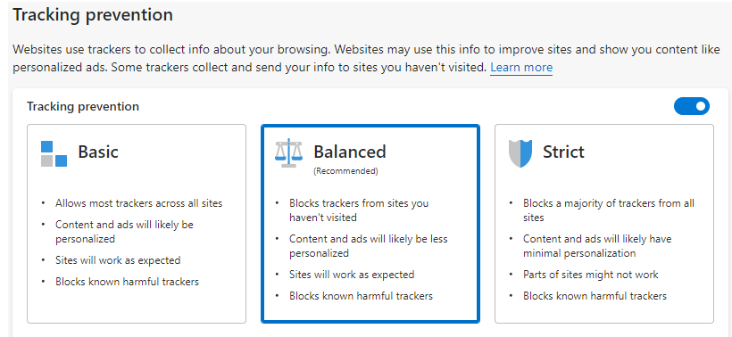

Tracking Prevention
===

# Background
The WebView2 team has been asked for an API to control levels of tracking prevention and also to turn off tracking prevention feature in WebView2.

We are proposing two API's

CoreWebView2Profile.PreferredTrackingPreventionLevel: This API allows you to control levels of tracking prevention for WebView2 which
are associated with a profile and persisted in the user data folder. However, the level is not respected if tracking prevention feature is
disabled using `CoreWebView2EnvironmentOptions.EnableTrackingPrevention`. That means, if you set the property when the feature is disabled
it is updated and persisted but it will takes effect only if `CoreWebView2EnvironmentOptions.EnableTrackingPrevention` is true.
The levels are similar to Edge: `Off`, `Basic`, `Balanced` and `Strict`.

For reference, in the screenshot below, this API sets the levels of tracking prevention as a WebView2 API.



CoreWebView2EnvironmentOptions.EnableTrackingPrevention: This API allows you to enable/disable the tracking prevention feature.
Default value is true. When this is true, the level of tracking prevention is controlled by the `CoreWebView2Profile.PreferredTrackingPreventionLevel` property.
You can set this property to false to disable the tracking prevention feature for WebView2 when creating environment that also skips the related code and improves the performance.

# Examples
## EnableTrackingPrevention

```c#
Create WebView Environment with option that disable tracking prevention feature.

void CreateEnvironmentWithOption()
{
    CoreWebView2EnvironmentOptions options = new CoreWebView2EnvironmentOptions();
    // If we're displaying app content or otherwise are not worried about tracking, we can
    // disable the tracking prevention feature to improve runtime performance.
    options.EnableTrackingPrevention = false;
    CoreWebView2Environment environment = await CoreWebView2Environment.CreateAsync(BrowserExecutableFolder, UserDataFolder, options);
}
```

```cpp
void AppWindow::InitializeWebView()
{
    auto options = Microsoft::WRL::Make<CoreWebView2EnvironmentOptions>();
    Microsoft::WRL::ComPtr<ICoreWebView2EnvironmentOptions3> options3;
    if (options.As(&options3) == S_OK)
    {
        // If we're displaying app content or otherwise are not worried about tracking, we can
        // disable the tracking prevention feature to improve runtime performance.
        CHECK_FAILURE(options3->put_EnableTrackingPrevention(FALSE));
    }
    // ... other option properties

    HRESULT hr = CreateCoreWebView2EnvironmentWithOptions(
        subFolder, m_userDataFolder.c_str(), options.Get(),
        Callback<ICoreWebView2CreateCoreWebView2EnvironmentCompletedHandler>(
            this, &AppWindow::OnCreateEnvironmentCompleted)
            .Get());
}
```

## PreferredTrackingPreventionLevel
Example of code in end user facing UI to change the TrackingPreventionLevel.

```c#

void SetTrackingPreventionLevel(CoreWebView2TrackingPreventionLevel value)
{
    CoreWebView2Profile webViewProfile;
    if (webView.CoreWebView2 != null)
    {
        webViewProfile = webView.CoreWebView2.Profile;
        WebViewProfile.PreferredTrackingPreventionLevel = value;
        MessageBox.Show(this, "Tracking prevention level is set successfully", "Tracking Prevention Level");
    }
}
```

```cpp
void SettingsComponent::SetTrackingPreventionLevel(
    COREWEBVIEW2_TRACKING_PREVENTION_LEVEL value)
{
    wil::com_ptr<ICoreWebView2_13> webView2_13;
    webView2_13 = m_webView.try_query<ICoreWebView2_13>();

    if (webView2_13)
    {
        wil::com_ptr<ICoreWebView2Profile> profile;
        CHECK_FAILURE(webView2_13->get_Profile(&profile));

        auto profile5 = profile.try_query<ICoreWebView2Profile5>();
        if (profile5)
        {
            CHECK_FAILURE(profile5->put_PreferredTrackingPreventionLevel(value));
            MessageBox(
                nullptr,
                L"Tracking prevention level is set successfully",
                L"Tracking Prevention Level", MB_OK);
        }
    }
}
```

# API Details
```
/// Tracking prevention levels.
[v1_enum] typedef enum COREWEBVIEW2_TRACKING_PREVENTION_LEVEL {
  /// Tracking prevention is turned off.
  COREWEBVIEW2_TRACKING_PREVENTION_LEVEL_NONE,
  /// The least restrictive level of tracking prevention. Set to this level to
  /// protect against malicious trackers but allows most other trackers and personalize content and ads.
  ///
  /// See [Current tracking prevention behavior](/microsoft-edge/web-platform/tracking-prevention#current-tracking-prevention-behavior)
  /// for fine-grained information on what is being blocked with this level. This can change with different Edge versions.
  COREWEBVIEW2_TRACKING_PREVENTION_LEVEL_BASIC,
  /// The default level of tracking prevention. Set to this level to
  /// protect against social media tracking in addition to malicious trackers. Content and ads will likely be less personalized.
  ///
  /// See [Current tracking prevention behavior](/microsoft-edge/web-platform/tracking-prevention#current-tracking-prevention-behavior)
  /// for fine-grained information on what is being blocked with this level. This can change with different Edge versions.
  COREWEBVIEW2_TRACKING_PREVENTION_LEVEL_BALANCED,
  /// The most restrictive level of tracking prevention. Set to this level to protect
  /// against malicious trackers and most trackers across sites. Content and ads will likely have minimal personalization.
  ///
  /// This level blocks the most trackers but could cause some websites to not behave as expected.
  ///
  /// See [Current tracking prevention behavior](/microsoft-edge/web-platform/tracking-prevention#current-tracking-prevention-behavior)
  /// for fine-grained information on what is being blocked with this level. This can change with different Edge versions.
  COREWEBVIEW2_TRACKING_PREVENTION_LEVEL_STRICT,
} COREWEBVIEW2_TRACKING_PREVENTION_LEVEL;

/// Additional options used to create WebView2 Environment.
[uuid(12e494a2-c876-11eb-b8bc-0242ac130003), object, pointer_default(unique)]
interface ICoreWebView2EnvironmentOptions3 : IUnknown {
  /// The `EnableTrackingPrevention` property is used to enable/disable tracking prevention feature in WebView2.
  /// This property enable/disable tracking prevention for all the WebView2's created in the same environment.
  /// By default this feature is enabled to block potentially harmful trackers and trackers from sites that
  /// aren't visited before and set to `COREWEBVIEW2_TRACKING_PREVENTION_LEVEL_BALANCED` or whatever value was 
  /// last changed/persisted on the profile.
  ///
  /// You can set this property to false to disable the tracking prevention feature if the app only renders
  /// content in the WebView2 that is known to be safe. Disabling this feature when creating environment also
  /// improves runtime performance by skipping related code.
  ///
  /// You shouldn't disable this property if WebView2 is being used as a "full browser" with arbitrary navigation
  /// and should protect end user privacy.
  ///
  /// There is `CoreWebView2Profile.PreferredTrackingPreventionLevel` property to control levels of tracking prevention
  ///  of the WebView2's associated with a same profile. However, you can also disable tracking prevention later using
  /// `CoreWebView2Profile.PreferredTrackingPreventionLevel` property and `COREWEBVIEW2_TRACKING_PREVENTION_LEVEL_NONE` value
  /// but that doesn't improves runtime performance.
  /// See `CoreWebView2Profile.PreferredTrackingPreventionLevel` for more details.
  ///
  /// Tracking prevention protects users from online tracking by restricting
  /// the ability of trackers to access browser-based storage as well as the network.
  /// See [Tracking prevention](microsoft-edge/web-platform/tracking-prevention).
  [propget] HRESULT EnableTrackingPrevention([out, retval]  BOOL* value);
  /// Sets the `EnableTrackingPrevention` property.
  [propput] HRESULT EnableTrackingPrevention([in]  BOOL value);
}

/// This is the ICoreWebView2 profile.
[uuid(ddc4070a-c873-11eb-b8bc-0242ac130003), object, pointer_default(unique)]
interface ICoreWebView2Profile5: IUnknown {
  /// The `PreferredTrackingPreventionLevel` property allows you to control levels of tracking prevention for WebView2 which
  /// are associated with a profile. This level would apply to the context of the profile. That is, all WebView2s sharing the same
  /// profile will be affected and also the value is persisted in the user data folder.
  ///
  /// See `COREWEBVIEW2_TRACKING_PREVENTION_LEVEL` for descriptions of levels.
  ///
  /// If tracking prevention feature is enabled when creating the WebView2 environment, you can also disable
  /// tracking prevention later using this property and `COREWEBVIEW2_TRACKING_PREVENTION_LEVEL_NONE` value
  /// but that doesn't improves runtime performance.
  ///
  /// There is `CoreWebView2EnvironmentOptions.EnableTrackingPrevention` property to enable/disable tracking prevention feature
  ///  for all the WebView2's created in the same environment. If enabled, `PreferredTrackingPreventionLevel` is set to
  /// `COREWEBVIEW2_TRACKING_PREVENTION_LEVEL_BALANCED` by default for all the WebView2's and profiles created in the same environment
  /// or is set to the level whatever value was last changed/persisted to the profile. If disabled `PreferredTrackingPreventionLevel`
  /// is not respected by WebView2. If `PreferredTrackingPreventionLevel` is set when the feature is disabled, the property value get changed and
  /// persisted but it will takes effect only if `CoreWebView2EnvironmentOptions.EnableTrackingPrevention` is true.
  ///
  /// See `CoreWebView2EnvironmentOptions.EnableTrackingPrevention` for more details.
  [propget] HRESULT PreferredTrackingPreventionLevel(
      [out, retval] COREWEBVIEW2_TRACKING_PREVENTION_LEVEL* value);
  /// Set the `PreferredTrackingPreventionLevel` property.
  ///
  /// If `CoreWebView2EnvironmentOptions.EnableTrackingPrevention` is false, this property will be changed and persisted to the profile but
  /// the WebView2 ignores the level silently.
  [propput] HRESULT PreferredTrackingPreventionLevel(
      [in] COREWEBVIEW2_TRACKING_PREVENTION_LEVEL value);
}
```

```c# (but really MIDL3)
namespace Microsoft.Web.WebView2.Core
{
    enum CoreWebView2TrackingPreventionLevel
    {
        None = 0,
        Basic = 1,
        Balanced = 2,
        Strict = 3,
    };

    // ...
    runtimeclass CoreWebView2EnvironmentOptions
    {
        // ...
        [interface_name("Microsoft.Web.WebView2.Core.ICoreWebView2EnvironmentOptions3")]
        {
            // ICoreWebView2EnvironmentOptions3 members
            Boolean EnableTrackingPrevention { get; set; };
        }
    }

    runtimeclass CoreWebView2Profile
    {
        // ...
        [interface_name("Microsoft.Web.WebView2.Core.ICoreWebView2Profile5")]
        {
            // ICoreWebView2Profile5 members
            CoreWebView2TrackingPreventionLevel PreferredTrackingPreventionLevel { get; set; };
        }
    }
}
```
